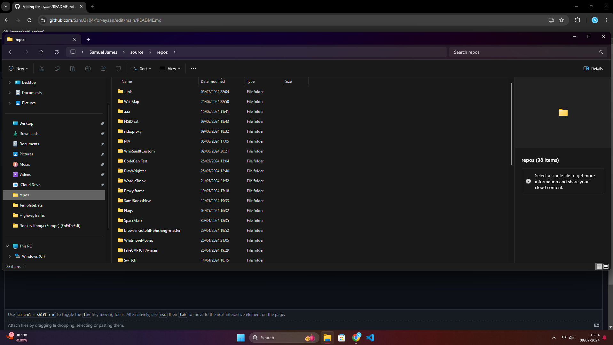
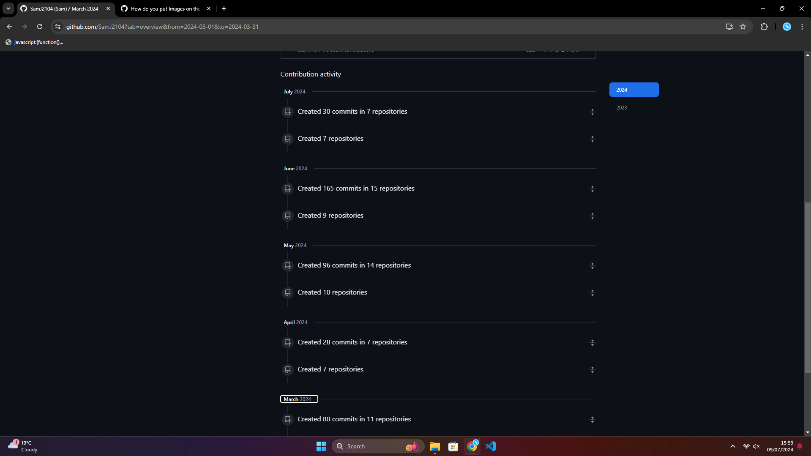

# proof that i made everything

ayaan keeps flipping saying that i paid someone to make the sites or smth so heres some proof that i actually made them

1. my vscode folder

2. literally updating the sites

3. all the projects are on my github with full commit (update) history and commit messages

i use some libraries and fork other peoples repos but that doesn't mean that i didnt make anything lol
